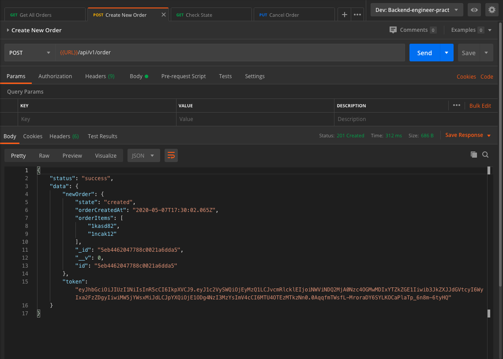

# Backend Engineer Practical: NodeJS Order Management Backend

2 small applications (micro-services) written with ExpressJS. Each of the services have their own purpose of existing and single responsibility.

1. Orders Application

   1. Responsible for orders management
   2. Each order can be at the single state at the time
   3. Order states - created, confirmed, delivered, cancelled
   4. After order was created Orders App should trigger Payments App call to process a payment for the current order.
   5. (Assuming that Orders already store an Auth information of the user, so you can send dummy PIN, Token, whatever)
   6. An Application should have API endpoints to:
      1. create an order
      2. cancel an order
      3. check order status

2. Payments Application
   1. Responsible for payment processing
   2. Payments App should handle requests by Order App to verify payment transaction and confirmed or declined an order.
   3. The logic behind the payment processing should be mocked and return a random result to the Orders App.

## Overview Diagram


## Architecture

The root directory contains 2 main directories, namely order and payment directory. The order directory contains the order.js and server.js(DB and server) as the main files. MVC architecture is used where codes are separated into controllers, models, and routes directory. The order is sent to the payment app for processing using RabbitMQ by pub/sub model to enable horizontal scaling.

## Getting Started

These instructions will get you a copy of the project up and running on your local machine for development and testing purposes. See deployment for notes on how to deploy the project on a live system.

### Prerequisites

- [Docker](https://www.docker.com/products/docker-desktop/)
- [Kubernetes](https://kubernetes.io/)
- [Helm](https://helm.sh/)

### Top-level Directory Layout

```bash
.
├── README.md
├── backend-helm
├── docker-compose.yml
├── images
├── k8s
├── order
└── payment
```

### Installing

A step by step series of examples that tell you how to get a development env running

- `git clone https://github.com/leoan96/Backend-engineer-practical.git`
- `docker-compose up`
- `Go to your browser and type localhost:8000`

## Deployment

Additional notes about how to deploy this on a live system using Google Cloud Platform and Kubernetes

#### First Method (Helm: Using backend-helm directory)


- `helm install backend-helm --generate-name`

#### Second Method (Kubernetes on GKE: Using k8s directory)

- `Sign in to Google Cloud Platform console`
- `Go to the Compute section and click on Kubernetes Engine`
- `Create Cluster`
- `Connect to the newly created cluster by clicking connect on the cluster dashboard`
- `kubectl create secret generic jwt \ --from-literal JWT_SECRET=3493edf6b95140d2e4037b63c6c8cab91db2c3e47110bbc8f5b8b3feb2c9ef36 \ --from-literal JWT_EXPIRES_IN=3d`
- `Connect to the kubernetes cluster using the google Cloud SDK`
- `type kubectl apply -f k8s`

## Screenshots

### Initial Empty Order


### Create New Order



### Payment Confirmed in Order


### Ordered Delivered


### Check Order Status


### Cancel Order


## Built With

- [ExpressJS](https://expressjs.com/) - Minimal and flexible Node.js web application framework
- [MongoDB](https://www.mongodb.com/) - Stores user data
- [Mongoose](https://mongoosejs.com/) - MongoDB validation, casting and business logic
- [RabbitMQ](https://www.rabbitmq.com/) - Enables the search module to be scaled horizontally
- [Kubernetes](https://kubernetes.io/) - Automated container deployment, scaling, and management
- [Helm](https://helm.sh/) - Helm is the best way to find, share, and use software built for Kubernetes.

## Authors

- **Loh Mun Kit** - _Initial work_ - [leoan96](https://github.com/leoan96)

## License

This project is licensed under the MIT License
